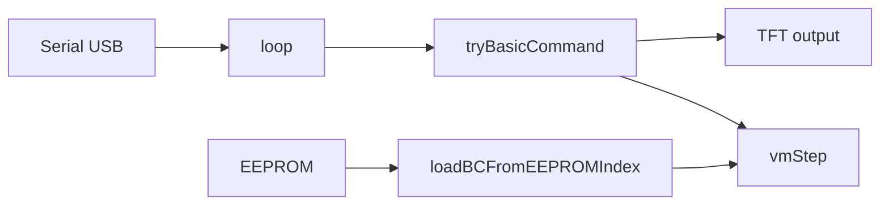

# TFT display terminal (Arduino Uno)

Firmware for an **Arduino Uno** that drives an **ILI9341** TFT as a **serial terminal** with a built-in **line-oriented “Mini-BASIC”** interpreter, a **tiny bytecode VM**, and **EEPROM** storage for multiple saved programs.

The main sketch lives in [`tft_display_uno/tft_display_uno.ino`](tft_display_uno/tft_display_uno.ino). A small Python helper in [`serial_tools/send_program.py`](serial_tools/send_program.py) can push a test bytecode program over USB serial.

---

## Hardware

| Signal   | Arduino pin |
|----------|-------------|
| TFT CS   | 10          |
| TFT DC   | 9           |
| TFT RST  | 8           |
| SD CS    | 4           |
| Touch CS | 5           |
| SPI      | 11 (MOSI), 12 (MISO), 13 (SCK) |

- **SPI speed:** 1 MHz (`TFT_SPI_HZ`).
- **Default rotation:** landscape (`TFT_ROTATION = 1`).
- **Built-in LED on pin 13:** not usable for simple blinking while the TFT uses SPI — pin 13 is **SCK**. Use another GPIO for LEDs (the example script uses pin 2).
- **TFT RST:** connected to the display controller reset; it is **not** used to clear the screen at runtime the way a full MCU reset does.

**Libraries (Arduino Library Manager):**

- Adafruit ILI9341  
- Adafruit GFX  

Also uses: `SPI`, `EEPROM`, AVR `pgmspace`.

---

## Serial link

- **Baud rate:** **115200** (constant `SERIAL_BAUD`).
- Each **line** is edited locally; **Enter** submits the line.
- **Backspace / DEL** deletes the last character on the editing line.
- **Carriage return** is normalized to newline.
- **Control characters** (other than BS/DEL) are ignored.
- Long lines are **wrapped** to the terminal width when the line does **not** look like a BASIC command; BASIC-looking lines are kept on one logical line up to `MAX_LINE_CHARS` (32 characters in the current build).

Output is mirrored to **both** the TFT (green for normal results, red for errors) and **Serial** (`Serial.println`).

---

## User interface on the TFT

- Text size 1, 8 px line height.
- A small **scroll history** (three green lines) is kept when the display fills; on full clear, older content is scrolled with `fillScreen` + history repaint.
- **`clear`** / **`restart`:** redraw the screen, reset scroll/history, reset numeric and string variables, and show the startup banner again (`UNO Terminal`, baud line, column/row info).
- **`reboot`:** full **MCU** restart (software jump to the reset vector — same practical effect as pressing the Arduino **Reset** button: `setup()` runs again, TFT and VM reinitialize). No arguments allowed; anything after `reboot` is reported as `unknown command` (flash size constraints).

---

## Mini-BASIC (one line per Enter)

Commands are **case-insensitive** where words are recognized. Many errors are short English strings on Serial/TFT (e.g. `unknown command`, `syntax: …`).

### Calculator / text

| Command | Meaning |
|--------|---------|
| `help` | Lists a short line of bytecode-related commands (`bcsave`, `bclist`, `bcdump`, `run`, `load`, `autorun`). |
| `print(expr)` | Prints a string literal, `concat(...)`, string variable, or numeric expression. |
| `sum(a,b)` `mul(a,b)` `sub(a,b)` `div(a,b)` | Two numeric arguments (literals or variables). Division by zero errors. |
| `concat(a,b)` | Concatenate two string or numeric pieces (see parser in firmware). |

### Variables and assignment

- **Numeric variables:** `V0` … `V7` (only indices **0–7** are stored). **Single-letter** names **`A`–`H`** map to `V0`–`V7`. Letters **I–Z** are **not** valid in the current build (`NUM_VARS` is 8). Variables must be **assigned** before use in expressions.
- **String variables:** `S0$`, `S1$` (two slots). **Single-letter** `A$`, `B$` map to `S0$`, `S1$`. Max length **8** characters per string (`STR_MAX_LEN`).
- **Assignment syntax:** `name = value` (e.g. `A=10`, `V3=42`, `S0$="hi"`).

### GPIO (Uno digital pins 0–19)

| Command | Meaning |
|--------|---------|
| `out(pin)` | `pinMode(pin, OUTPUT)` |
| `in(pin)` | `pinMode(pin, INPUT)` |
| `high(pin)` | `digitalWrite(pin, HIGH)` (after `out`) |
| `low(pin)` | `digitalWrite(pin, LOW)` |

Pins used by the TFT, SD, SPI, or touch CS are **reserved** and rejected (`pin reserved`). Range is enforced (`pin out of range`).

### Terminal / VM control

| Command | Meaning |
|--------|---------|
| `restart` | TFT + terminal state reset (optional `restart()`). |
| `clear` | Same idea as restart (optional `clear()`). |
| `reboot` | Full Arduino reset (see above). |
| `run` | Start bytecode VM from RAM. Optional `run(n)` loads program **index** `n` from EEPROM first (`n` = 0–31). |
| `run(n)` | Loads program `n` then runs. |
| `load` | Load program **0** from EEPROM into RAM. |
| `load(n)` | Load program `n` (`n` in parentheses). |
| `stop` | Stop the VM. |

### Bytecode: building a program in RAM

The VM executes up to **`BC_MAX_INS` (48)** instructions. Strings for bytecode live in a small RAM pool (`BC_STR_MAX` strings, `BC_STR_POOL_MAX` bytes total).

| Command | Meaning |
|--------|---------|
| `bc(op,arg)` | Append one instruction. **Opcode** can be a number **0–7** or a name: `nop`, `high`, `low`, `sleep`, `sleep100`, `sleeps`, `goto`, `print`, `end`, `put`. See [Bytecode opcodes](#bytecode-opcodes) below. |
| `bcx(op,t,a)` | Append instruction with explicit opcode, parameter type, and argument (advanced; same limits as `bc`). |
| `bcstr"text"` or `bcstr("text")` | Add a string to the pool; used by `print`/`put` with string ids. |
| `bcclr` | Clear RAM bytecode, strings, VM; mark as not compiled. |
| `bcsave` | Append current RAM program as a **new** record in EEPROM (if space allows). Resets `progNeedsSave` on success. |
| `bclist` | List decoded instructions in RAM (opcodes, params) and string table. |
| `bcdump` | Hex dump of the **binary EEPROM record** layout for the current RAM program. |
| `plist` | Print how many programs are stored (`programs:N`). |
| `eperase` | Reinitialize EEPROM container (wipes stored programs metadata), clear RAM bytecode. |

### Autorun (stored in EEPROM header, layout v2)

- `autorun` — show whether autorun is on and which program index runs at boot.
- `autorun off` — disable.
- `autorun on` or `autorun on n` — enable autorun for program index **n** (must exist).

On **`setup()`**, if autorun is enabled and the index is valid, the firmware loads that program and starts the VM (`vm running`). If that load fails, it may fall back to loading program 0.

---

## Bytecode opcodes

16-bit words pack: opcode, parameter count, parameter type, and 6-bit argument (see `bcPack` in the sketch).

| Op | Name | Role |
|----|------|------|
| 0 | `nop` | No operation. |
| 1 | `high` | `digitalWrite(pin, HIGH)`; pin in low 6 bits. |
| 2 | `low` | `digitalWrite(pin, LOW)`. |
| 3 | `sleep` | Delay (see below). |
| 4 | `goto` | Jump to instruction index `arg`. |
| 5 | `print` | Print number or string id (flush line to TFT/Serial). |
| 6 | `end` | Stop VM and flush print buffer if needed. |
| 7 | `put` | Append to print buffer without flushing. |

**Sleep variants** (via `bc(sleep,…)`):

- `bc(sleep, ms)` — **0–511** ms (`PT_NUM6` packed across instruction bits).
- `bc(sleep100, n)` — **n × 100** ms, **n** = 0–63 (up to 6.3 s); stored as string-id style delay.
- `bc(sleeps, n)` — **n** seconds, **n** = 0–63.

The VM runs **one step per `loop()`** iteration when not waiting on a timer (`millis()`-based sleep).

---

## EEPROM on-disk layout (summary)

- **Magic:** `'B' 'C'`, version byte.
- **v1:** 4-byte header; **v2:** 6-byte header (adds **autorun enable** + **program index**).
- Up to **31** programs (`count` in header).
- Each program record: start marker, instruction count, string count, **little-endian** 16-bit words, then string blobs (length-prefixed), end marker.

Old v1 images are **migrated** to v2 when autorun is written.

---

## Resource limits (typical)

- **Flash:** the Uno build is **very tight** (~99% of 32 KiB with the current feature set); small changes can break the link step.
- **RAM:** global buffers for line, history, bytecode, strings, VM print buffer — see `MAX_LINE_CHARS`, `BC_MAX_INS`, `NUM_VARS`, etc.

### Recent size/RAM optimizations (last 10 commits + current tuning)

The codebase has been gradually tuned to keep the Uno build under limits. Key changes:

- **Parser/output deduplication:** repeated command handlers were consolidated (notably pin commands and math commands), reducing duplicated machine code in flash.
- **Output path cleanup:** serial output was unified behind `serialOutLine(...)` to reduce repeated call patterns and keep code paths simpler.
- **Feature-growth control:** new features (like EEPROM autorun and extra bytecode tooling) were added with short PROGMEM messages and compact parser branches to reduce flash pressure.
- **One-line runtime print strategy:** VM print output can be rendered in a single fast row path to avoid expensive full-screen redraw churn during long-running programs.
- **Tighter helper text:** help and status text was shortened/split to keep diagnostics readable while reducing static string footprint.

Current Uno compile reference (after latest refactors):

- **Flash:** `32184 / 32256 bytes` (~99%)
- **Global RAM:** `1184 / 2048 bytes` (~57%)
- **Headroom:** flash is still tight; prefer deduplication and short PROGMEM strings for future changes.

---

## Building and uploading

1. Open [`tft_display_uno/tft_display_uno.ino`](tft_display_uno/tft_display_uno.ino) in Arduino IDE 2.x or Arduino CLI.
2. Board: **Arduino Uno**, programmer as usual.
3. Install **Adafruit ILI9341** and **Adafruit GFX**.

Example CLI:

```bash
arduino-cli compile -b arduino:avr:uno tft_display_uno
arduino-cli upload -b arduino:avr:uno -p /dev/cu.usbmodemXXXX tft_display_uno
```

---

## Python helper: `send_program.py`

Sends a fixed list of lines (erase, build bytecode, save, run) with delays and prints device replies.

**Dependency:** `pyserial` (`pip install pyserial`).

```bash
python3 serial_tools/send_program.py --port /dev/cu.usbmodem1101
```

Options include `--baud`, `--line-delay`, and timeouts for reading responses. Edit `PROGRAM_LINES` and `BLINK_PIN` at the top of the script to match your wiring.

---

## Conceptual architecture



- **Normal text lines** are echoed into the terminal UI (green) when not handled as BASIC.
- **BASIC lines** execute and update TFT + Serial without treating the line as plain chat text.
- The **VM** shares the CPU with serial handling and TFT updates; long sleeps are **non-blocking** (`millis`).

---

## Troubleshooting

| Symptom | Things to check |
|--------|-----------------|
| Blank screen after wiring | Power, backlight, CS/DC/RST pins, `tft.begin` SPI frequency. |
| Garbage on serial | Baud **115200**, correct USB port. |
| `save failed/full` | EEPROM full or record too large; reduce instructions/strings or `eperase`. |
| Autorun not running | `autorun on n` with valid `n`; EEPROM layout; program loads without errors. |
| Link error “text section exceeds” | Uno flash full; remove features or shrink strings / optimize. |

---

## License / project notes

This repository is a personal learning project. Adapt pins, buffers, and commands to your own hardware if you move beyond the Uno + ILI9341 setup described here.
